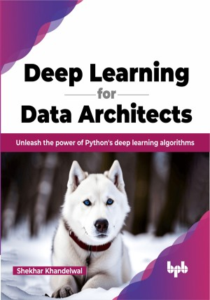

# Deep Learning for Data Architects

A hands-on guide to building and deploying deep learning models with Python

This is the repository for [Deep Learning for Data Architects
](https://bpbonline.com/products/deep-learning-for-data-architects?variant=42860093898952),published by BPB Publications.

## About the Book
“Deep Learning for Data Architects” is a comprehensive guide that bridges the gap between data architecture and deep learning. It provides a solid foundation in Python for data science and serves as a launchpad into the world of AI and deep learning.

The book begins by addressing the challenges of transforming raw data into actionable insights. It provides a practical understanding of data handling and covers the construction of neural network-based predictive models. The book then explores specialized networks such as convolutional neural networks (CNNs), recurrent neural networks (RNNs), and generative adversarial networks (GANs). The book delves into the theory and practical aspects of these networks and offers Python code implementations for each. The final chapter of the book introduces Transformers, a revolutionary model that has had a significant impact on natural language processing (NLP). This chapter provides you with a thorough understanding of how Transformers work and includes Python code implementations.

By the end of the book, you will be able to use deep learning to solve real-world problems.

## What You Will Learn
•  Develop a comprehensive understanding of neural networks' key concepts and principles.

•  Gain proficiency in Python as you code and implement major deep-learning algorithms from scratch.

•  Build and implement predictive models using various neural networks

•  Learn how to use Transformers for complex NLP tasks

•  Explore techniques to enhance the performance of your deep learning models.
